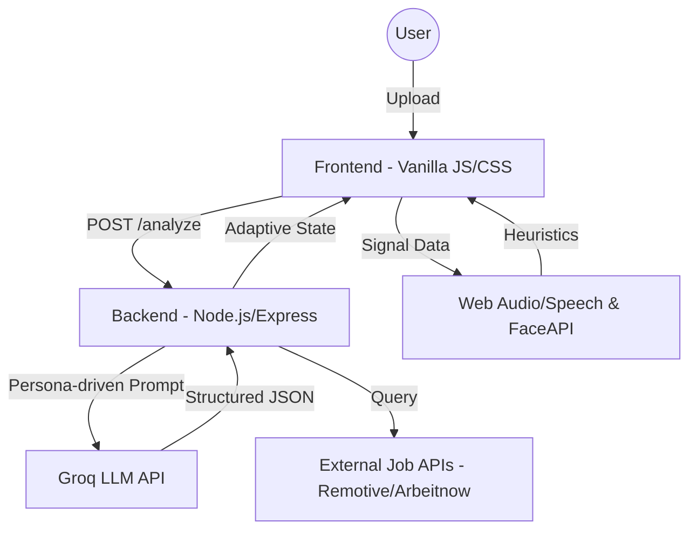

# InterviuX: Technical Architecture Document

## 1. Problem Summary & User Journey
Traditional mock interview tools often focus on static question banks and text-only feedback. **InterviuX** solves this by providing an **Agentic AI platform** that adapts in real-time to a candidate's specific background, verbal confidence, and visual engagement.

### User Journey:
1.  **Resume Ingestion:** User uploads a PDF or text resume.
2.  **Role Inference:** The system analyzes the resume to infer roles, seniority, and skill gaps.
3.  **Job Matching:** Real-time job postings are fetched and ranked against the candidate's profile.
4.  **Adaptive Interview:** A multi-agent orchestrator conducts a 5-phase interview (Warm-up → Core → Deep-dive) with difficulty adapting based on performance.
5.  **Multimodal Evaluation:** Audio (pace, fillers) and Visual (eye contact, posture) signals are captured during answers.
6.  **Coaching Report:** A comprehensive report with technical, communication, and visual scores is generated with an actionable 30-day plan.

---

## 2. High-Level Architecture
InterviuX follows a **Distributed Agent Architecture**, splitting heavy LLM logic on the backend and real-time sensory processing on the client.

### Data Flow Diagram:

### Core Components:
-   **Resume Parser Agent:** PDF text extraction + Skill/Gap analysis.
-   **Interview Orchestrator:** State-machine based difficulty adaptation.
-   **Audio/Linguistic Agent:** Real-time WPM, filler word, and hesitation detection.
*   **CV Engine:** `face-api.js` client-side eye-tracking and posture heuristics.
-   **Scoring Engine:** Persona-based multi-dimensional evaluation rubric.

---

## 3. Design Choices & Trade-offs
-   **Vanilla JS/CSS:** Chosen for **zero-dependency performance** and maximum control over high-fidelity animations.
-   **Groq Llama-3 (70B/8B):** Selected for **ultra-low latency inference** (<1.5s), enabling a natural "human-like" conversation flow.
-   **Client-Side CV (face-api.js):** We process video frames locally. **Trade-off:** Lower precision than server-side deep learning, but ensures **100% privacy** and zero bandwidth cost for video streaming.
-   **Deterministic Nonsense Filter:** A regex-based pre-flight layer intercepts "idk" or fluff answers before LLM processing to save tokens and ensure brutal honesty in scoring.

---

## 4. Scoring Methodology
Our scoring is derived from three independent intelligence layers:

### A. Technical Score (1-10)
Uses a **Strict Senior Technical Lead** persona. For System Design, it uses a weighted rubric:
- Requirements (15%) | HLD (20%) | Data Modeling (15%) | Scalability (20%) | Bottlenecks (15%) | Trade-offs (15%).

### B. Communication Score (1-10)
- **Acoustic:** Penalty for Speaking Pace <100 WPM (too slow) or >175 WPM (too fast).
- **Linguistic:** Deduction for every "Filler Word" (um, uh, like) and Hesitation pauses (>1.2s).
- **Signal:** Standard deviation of pitch variation used to measure expressiveness.

### C. Visual Engagement Score (1-10)
- **Eye Contact:** Percentage of time the candidate is looking at the camera.
- **Posture:** Heuristic check on bounding box center to detect slouching or looking away.

### D. Final Aggregate
Weighted average: `(Tech * 0.5) + (Comm * 0.3) + (Visual * 0.2)`.

---

## 5. Limitations & Future Work
-   **Language Support:** Currently optimized for English. Future work includes multilingual transcription and localized cultural interview styles.
-   **Advanced Emotion Analysis:** Current emotion detection is based on basic facial landmarks. Integration with deeper spectral audio analysis (Prosody) is planned.
-   **Collaborative Mode:** Future versions will allow peer-to-peer mock interviews with AI-assisted "Co-pilot" scoring for both parties.
